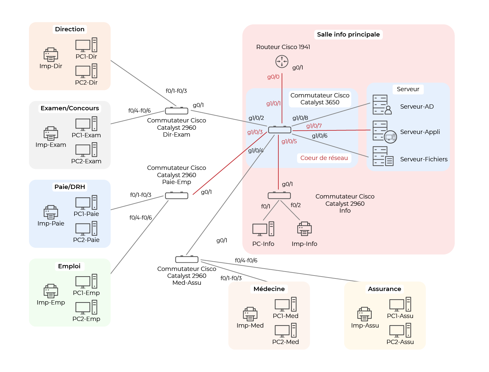
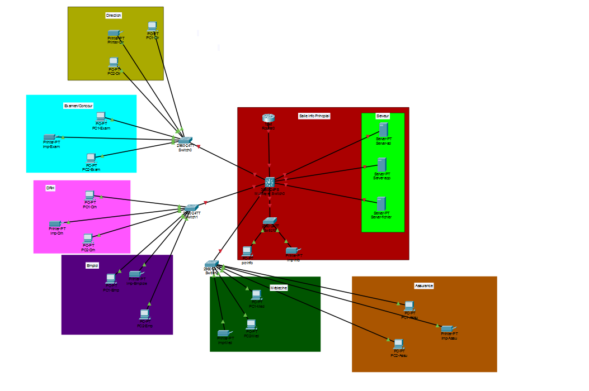

comme objectuf numero 1 fallais que je mette en place les équipement comme le shéma ci dessous 

sur cisco packet tracer ca donne ca :

vous pouvez trouver le fichier cisco dans ce meme dossier (projet_version1.pkt)

